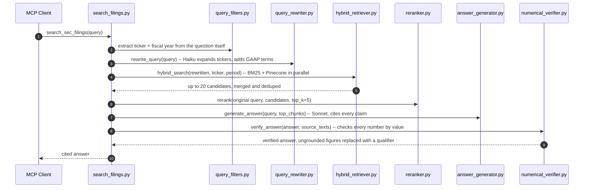
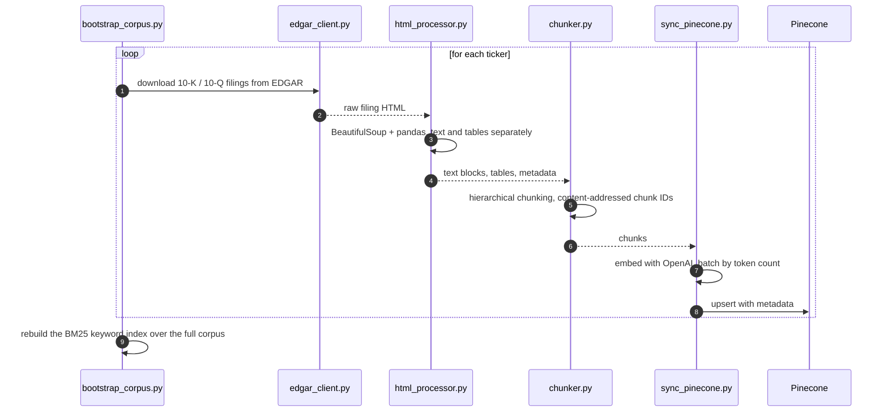

# FinRAG MCP

Cited, grounded financial intelligence over SEC filings, exposed as MCP tools that any AI assistant can call.

Ask Claude or ChatGPT a specific financial question and you usually get one of three things: outdated training data, a confidently stated number that's just made up, or an answer with nothing to check it against. FinRAG MCP grounds every answer in real 10-K, 10-Q, and 8-K filings pulled straight from SEC EDGAR. It checks every number in the answer against the retrieved source text and cites the exact filing it came from.

**Live site:** [dashboard-weld-nine-28.vercel.app](https://dashboard-weld-nine-28.vercel.app). It has the landing page, a replay of a real recorded query, the numerical verifier running live in your browser (ported to TypeScript), and the eval results below in one place.

## Architecture

Four stages: query rewriting (Haiku, plus a deterministic GAAP line-item expansion), parallel keyword search (SQLite FTS5, BM25-ranked) and Pinecone dense search, reranking, then Bedrock Sonnet generation with a numerical grounding check at the end.

**Query pipeline** (see `diagrams/query-sequence.mmd` for the full version with every fix and bug fix annotated):



**Ingestion pipeline** (see `diagrams/ingestion-sequence.mmd` for the full version, including the weekly EventBridge refresh that diffs EDGAR instead of re-ingesting everything):



## Eval results

Scored against [FinanceBench](https://huggingface.co/datasets/PatronusAI/financebench) (150 public questions with verified answers) plus a set of custom questions I wrote and verified by hand against the actual filings (`evals/eval_data/custom_150.json`, 48 done so far, the easy tier; medium, hard, and table tiers are still open, see `CLAUDE.md` Phase D2). Scored with [ragas](https://github.com/explodinggraphs/ragas) plus a custom numerical grounding verifier I wrote myself.

| Metric | FinanceBench (150Q) | Custom verified (48Q) | Combined (198Q) | What it measures |
|---|---|---|---|---|
| **Numerical accuracy** | **91.0%** | 86.2% | **89.9%** | Percent of numbers in generated answers that appear verbatim in the retrieved source chunks. My own deterministic verifier, not LLM-judged. |
| **Faithfulness** | **79.4%** | **85.4%** | **80.2%** | Ragas: does the answer only make claims supported by the retrieved context. |
| Answer relevancy | 15.6% | 16.3% | 16.2% | Ragas: does the answer address the question asked. |
| Context precision | 20.3% | 3.1% | 15.3% | Ragas: are the retrieved chunks actually relevant to the question. |
| Context recall | 9.5% | 2.1% | 8.9% | Ragas: did retrieval capture everything needed to answer. |

A few things worth being upfront about instead of glossing over.

Numerical accuracy and faithfulness are the two metrics I trust the most, since there's no ambiguity in what they measure, and both look solid on both datasets. But the custom set actually scores lower on numerical accuracy (86.2% vs 91.0%) even though every one of its answers was hand-verified against the real filing text. I traced this down instead of leaving it as a mystery:

1. About half the gap is just a measurement bug, not a real retrieval failure. The regex that extracts numbers from an answer reads "Q4" as the number 4. Eleven of the 48 custom questions got an honest, correctly grounded refusal ("the context does not provide..."), exactly what the system is supposed to do when it can't find the number, and each one still got docked for a "number" the answer never actually claimed.
2. The rest is a real, reproducible retrieval bug. For questions phrased like "Q4 202X," the pipeline sometimes retrieves and cites the wrong fiscal quarter's filing entirely, not just a column mix-up in the same document. I confirmed this by reading the retrieved chunks directly: asked for AT&T's Q4 2025 revenue, it answered from a Q1 2026 10-Q's prior-year comparative column instead. Merck and Disney show the same pattern. A separate case with Bank of America pulled the right filing but the wrong number inside it, a segment subtotal that shares the exact same line label as the consolidated total elsewhere in the filing.

Neither of these is fixed in code yet. The fiscal-year filter isn't tight enough for fiscal *quarter* on some tickers, and nothing currently tells a segment subtotal apart from a consolidated total with the same label. Both are real next steps.

The three ragas metrics (relevancy, precision, recall) are a separate, genuinely open question. They score low across every complete eval run, even after I manually confirmed that retrieval finds the exact right chunk and number for spot-checked questions (see the 3M capex example in `diagrams/query-sequence.mmd`). My working theory is that ragas's LLM-judged metrics just don't fit this task well: short numeric ground truths scored against long financial table chunks. I haven't traced this one to a specific cause the way I did the numerical accuracy gap, so I'm leaving it as an open question rather than pretending I've solved it.

### Baseline comparison

Same 150 FinanceBench questions, three retrieval setups. The baselines skip query rewriting and reranking: Baseline A takes Pinecone's raw dense matches, Baseline B takes the keyword index's raw BM25 matches, both straight into generation.

| Metric | Baseline A (dense only) | Baseline B (BM25 only) | Full pipeline |
|---|---|---|---|
| Numerical accuracy | 86.5% | **94.4%** | 91.0% |
| Faithfulness | 79.4% | **83.8%** | 80.1% |
| Answer relevancy | 16.1% | 10.1% | 15.6% |
| Context precision | 14.1% | 14.2% | 20.0% |
| Context recall | 10.8% | 14.1% | **11.3%** |

Plain keyword search beats the full four-stage pipeline on this particular benchmark. FinanceBench's questions are worded close to how the filings themselves say things, so lexical search does well on its own. What the full pipeline clearly buys over dense-only search is the jump in numerical accuracy and context recall versus Baseline A: hybrid retrieval and rewriting help most exactly where a plain embedding misses a jargon-heavy financial term. Whether the extra complexity is worth it over BM25 alone, for FinanceBench-style questions specifically, is an open question. A harder or more paraphrased set of questions would probably favor the full pipeline more.

One real bug came up while running Baseline B: unlike the full pipeline, BM25-only has no reranking pass to screen out an oversized chunk, and the chunker doesn't cap table chunks the way it caps text chunks. A large schedule table blew past Sonnet's context window on question 91 of 150. Fixed once, in the shared `generate_answer()` call, since any retrieval path can hand it an oversized chunk.

### Cost and latency

Measured on a fixed set of 15 FinanceBench questions, run individually against the real Bedrock, OpenAI, and Pinecone dependencies (not mocked), logged to DynamoDB. `cost_usd` is a text-length token estimate, not exact provider billing, so it's directionally right for a before/after comparison but not a substitute for the actual billing console.

| | Before caching and routing | After |
|---|---|---|
| Avg cost per query | $0.013677 | $0.012586 |
| Avg latency | 24,109 ms | 24,074 ms |

Both numbers barely moved, and that's expected rather than a letdown. This particular test set only exercises `search_sec_filings`, which is the one tool the caching and model-routing changes mostly don't touch. Bedrock prompt caching was evaluated and skipped on purpose: the system prompt is under Sonnet's 1,024-token caching minimum, and a cold cache at this query rate would cost more per miss than no caching at all. Model-tier routing (Haiku for single-metric lookups) does help where it applies, `get_company_financials` answered identically on Haiku at about a third of the cost of Sonnet in a live comparison. The query result cache also works as intended, a repeat question within 24 hours hits in about 67ms instead of 23 seconds, but this particular 15-question set is deliberately all distinct questions, so it shows zero cache hits by design.

### Corpus coverage

- 70 of 72 target companies ingested: 1,030 filings (506 10-Q, 284 10-K, 240 8-K), 164,092 chunks. Full 2018 to 2026 depth for the 31 companies FinanceBench asks about, 2025 to 2026 for the rest.
- Spotify (SPOT) has no 10-K or 10-Q filings. It's a foreign private issuer that files Form 20-F instead, which is outside this project's scope by design.
- PayPal (PYPL) is temporarily missing. Pinecone's free-tier monthly write cap ran out mid-project. Costs exactly one FinanceBench question.

### Question coverage

Of the 150 FinanceBench questions: 112 ask about 10-K filings, 15 about 10-Q, 9 about 8-K, all in scope. 14 ask about earnings call transcripts, which this project doesn't ingest on purpose (third-party transcript copyright). Realistic ceiling given the current scope is about 135 of 150, plus the one PYPL question.

## Deployment

Runs on AWS Lambda behind a Function URL. No API Gateway, since its 29 second timeout is too short for a cold-start index download.

- **Runtime:** Python 3.13, arm64, 2048 MB, 2 minute timeout, 2 GB of ephemeral storage for the roughly 900 MB keyword index that gets cached in `/tmp`.
- **Auth:** Cognito OAuth 2.1 with PKCE, and it's the only accepted credential. Verified end to end from a real client (Claude Desktop, not just curl). Checked before any cold-start work happens, so an unauthenticated request costs nothing.
- **Secrets:** SSM Parameter Store, resolved at runtime. Only parameter names live in the CDK template, never values.
- **IAM:** scoped to the exact S3 prefix, SSM path, and Bedrock models it needs. No wildcards.
- **Bundling:** local pip install for the Lambda platform, no Docker. About 79 MB, well under the zip limit.
- **Cost at rest:** $0. Lambda only bills on invocation.
- **Observability:** a CloudWatch dashboard graphs invocations, errors, and latency. Per-query LLM cost is tracked separately in DynamoDB, one row per query.
- **Known limit:** this AWS account has a concurrency ceiling of 10, below the usual default of 1000, since it's a newer account. Fine for personal or demo use, would need a support ticket before any real concurrent load.

**Connecting a client:** clients that support remote HTTP servers natively can point straight at the Function URL. Claude Desktop's local build can't (it only speaks stdio), so it needs a bridge. [`mcp-remote`](https://www.npmjs.com/package/mcp-remote) does that job.

```json
{
  "mcpServers": {
    "finrag": {
      "command": "npx",
      "args": [
        "-y", "mcp-remote",
        "<Function URL>/mcp",
        "--static-oauth-client-info", "{\"client_id\":\"5n9n0e2ugjnklckjlrtc50p9c4\"}",
        "--static-oauth-client-metadata", "{\"scope\":\"openid finrag/invoke\",\"token_endpoint_auth_method\":\"none\"}"
      ]
    }
  }
}
```

A couple of things that only showed up once I actually tried logging in, not just deploying: `mcp-remote` defaults to OAuth dynamic client registration, which Cognito doesn't support, so it needs `--static-oauth-client-info` pointing at a pre-registered app client. Cognito's discovery metadata also never lists custom scopes, so without pinning `scope` explicitly, login succeeds but every request comes back 401. And since this is a public PKCE client with no secret, `token_endpoint_auth_method` has to be set to `none` or `mcp-remote` tries to authenticate with a secret that doesn't exist.

Claude Desktop only reads its config at launch, so after editing it you need to fully quit the app (not just close the window) before it picks up the change.

## What's built and what's left

| | Status |
|---|---|
| Ingestion pipeline (EDGAR to chunk to embed to Pinecone/FTS5) | Done |
| Four-stage retrieval and numerical verification | Done |
| Eval harness (FinanceBench, ragas, CI gate) | Done |
| AWS deployment (Lambda + Function URL) | Done |
| All four MCP tools (search, financials, compare, latest filing) | Done, live-tested |
| Cognito OAuth 2.1/PKCE | Done, verified end to end |
| EventBridge weekly refresh | Deployed, not yet run in production |
| Public dashboard site | Done, live at the link above |
| Observability dashboard | Done |

See `CLAUDE.md` for the full build history and everything still open, including the CI faithfulness gate, the remaining custom question tiers, and the PYPL backfill.
